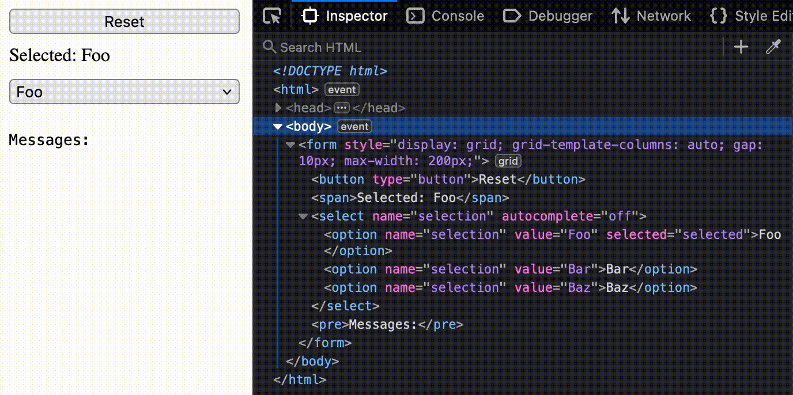

# yew-select-firefox

This crate demonstrates an issue with Firefox where html `<select>` options are
selected by means other than clicking (e.g. a "Reset" button) are updated in
the DOM but not displayed. Is there a workaround for this in [`yew`](https://github.com/yewstack/yew)?

